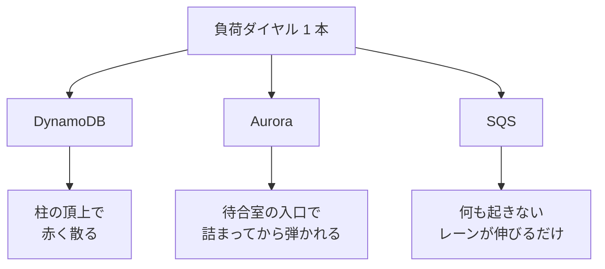

# M4-2b — SQS を three.js 空間へ描く

Issue #27 / PR は `feat/27-sqs-site`。M4-2a (#25) で用意した純粋関数を three.js の物体に写した段。
**Core にもモデルにも変更は無い。**

## 何ができるようになったか

1 つの空間に 3 つ目の敷地が立ち、同じ負荷を流したときの**壊れ方の三分類**が絵として揃った。

| | 壁を語る物 | 過負荷の絵 | 警報 |
|---|---|---|---|
| DynamoDB | 基準面を突き抜けた柱 | 頂上で赤く散る | エラー率 |
| Aurora | 有限の席 (`max_connections`) | 席が埋まってから入口で弾く | レイテンシ |
| **SQS** | **無い** | **レーンが伸びる。色すら変わらない** | **年齢の縦棒だけ** |

## 描いた物

- **レーン** — `backlogLaneLength(backlogVisible)` の長さで奥 (-z) へ伸びる。
  尾は背景色へ沈んで終わらない（＝器が無い）
- **consumer の設備** — 稼働率で光る。**本数は描かない**
- **年齢の縦棒** — `ApproximateAgeOfOldestMessage`。レーンと**直交する軸**に立ち、
  保持期間 100% で頭打ちになる（柱と違って決して突き抜けない）
- **粒子** — 源から**列の尾**に着地し、手前の consumer へ進む。
  **拒否の抽選が 1 つも無い**。期限切れだけはその場で静かに薄れる

## 実画面で見えたこと（保持 60 秒・500 q/s → 380 q/s へ低下）

| | DynamoDB | Aurora | SQS |
|---|---|---|---|
| 見えるもの | スロットル **0%** | レイテンシ **51ms** | 年齢バーが振り切り、**毎秒 100 件を失う** |

手前 2 つが完全に健全なまま、3 つ目だけが黙ってデータを失っている。
しかも**バックログは減っている最中**である（先頭はまだ過負荷の層に居るので年齢は伸び続ける）。

## 実装して分かったこと

### 1. ⚠️ ストックを描くところに `damp` を入れてはいけない

柱 (`PartitionColumns`) が追従を要るのは、描いているのが**レート**（tick ごとに跳ねる量）
だからである。レーンが描いているのはバックログという**ストック**で、
到着と消化の積分なので跳ねようがない。

にもかかわらず入れると壊れる。板 (`SqsSite`) と粒子 (`SqsParticles`) は
**同じ関数を同じ入力で呼んで**位置を合わせているので、片方だけ平滑を挟むと値が食い違い、
**負荷を跳ね上げた直後に粒子が板の外の虚空へ降る**。

> 「同じ関数を呼ぶ」は一致の保証にならない。**同じ値を見る**必要がある。

（reviewer の指摘。実装時に実際に踏んだ）

### 2. 色は「意味の系統」で分ける

赤は 3 敷地を通じて**「弾かれた」**に割り当ててある。
SQS の消失はエラーを伴わない — 誰にも通知されず、CloudWatch のエラー率にも出ない。
同じ赤で塗ると「エラーを伴わない唯一のデータ損失」が「よくある拒否」に見えるので、
年齢バーの振り切りは**マゼンタ**（別系統）にした。粒子は色すら変えず、その場で薄れる。

同じ理由で、**レーンは何件溜まっても色が変わらない**。
色づけた瞬間に「溜める。何も起きない」が絵の上で嘘になる。

### 3. 寸法の式は書き写さない

`groundGrid` が敷地の `LANE_HEAD_Z` を勘定しておらず、いちばん伸びたときだけ
尾が地面から 0.05〜0.35 はみ出していた。テスト側も**同じ式を書き写していた**ので検出できない。
→ `sqsSiteMetrics().tailZ` から測る形に直した。寸法の構造が変わっても自動で追従する。

## 触ったファイル

| | |
|---|---|
| `src/view/scene/SqsSite.tsx` | 新規。レーン / consumer / 年齢バー |
| `src/view/scene/SqsParticles.tsx` | 新規。拒否の抽選が 1 つも無い粒子 |
| `src/view/scene/paint.ts` | 新規。`AuroraSite` と共有するメッシュ 1 枚の塗り替え |
| `src/view/layout.ts` | `LANE_HEAD_Z` / `LANE_REACH_LIMIT` / `groundGrid()` |
| `src/view/palette.ts` | `BACKGROUND` / `LANE_BODY` / `ageColor()` / `CONSUMER_*` |
| `src/view/scene/TerrariumScene.tsx` | 3 つ目の敷地、地面を `groundGrid()` 由来へ |

## 次（M4-2c）

`ComparisonHud` に 3 列目（指標名は CloudWatch のまま）、ControlPanel に SQS のダイヤル、
Playwright。申し送りは PLAN.md「M4-2c への申し送り」にある。
